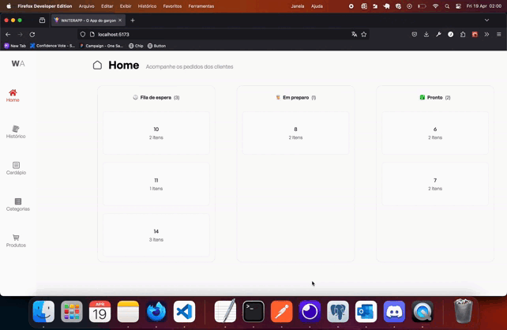

# WaiterApp

O WaiterApp é uma aplicação web para gerenciamento de pedidos em um restaurante, construída com uma stack que inclui React, Vite e Flask.

## Stack

- **Frontend**:
  - React: Biblioteca JavaScript para construção de interfaces de usuário.
  - Vite: Construtor de aplicações web extremamente rápido, oferecendo carregamento instantâneo e suporte a HMR.
- **Backend**:
  - Flask: Framework web em Python, leve e flexível, utilizado para construir o back-end da aplicação.

## Funcionalidades Principais

- Gerenciamento de pedidos: Visualização, edição e exclusão de pedidos.
- Gerenciamento de categorias e produtos: Adição, edição e exclusão de categorias e produtos.
- Interface amigável e intuitiva para facilitar o uso pelos funcionários do restaurante.

## Instalação e Uso

1. Clone o repositório.
2. Configure e execute o backend (Flask).
3. Configure e execute o frontend (React + Vite).

## Como Contribuir

Sinta-se à vontade para contribuir com novas funcionalidades, correções de bugs ou melhorias no código. Basta seguir estas etapas:

1. Faça um fork do repositório.
2. Crie uma nova branch com a sua feature (`git checkout -b feature/nova-feature`).
3. Faça commit das suas alterações (`git commit -am 'Adicionando nova feature'`).
4. Faça push para a branch (`git push origin feature/nova-feature`).
5. Crie um novo Pull Request.



```
Feito por Jéssyca Noronha ❤️ 🤘🏿
```
